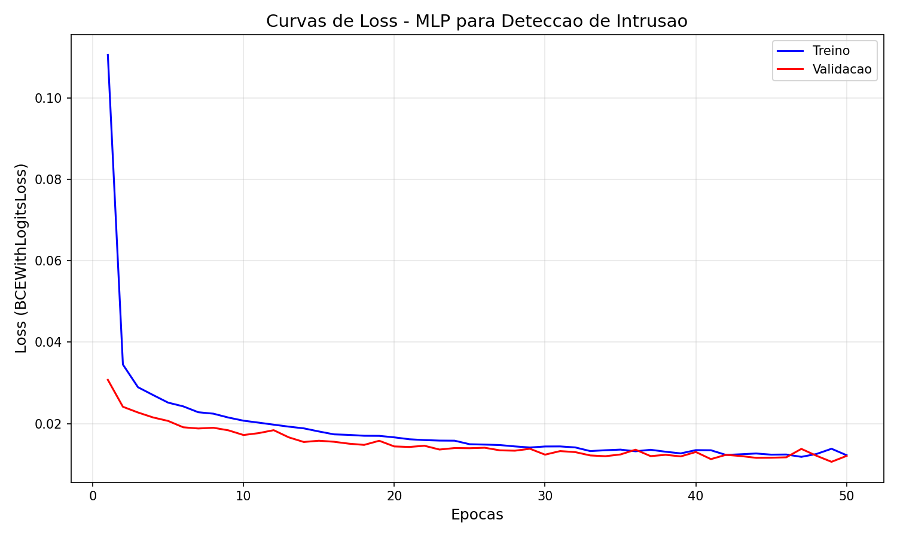
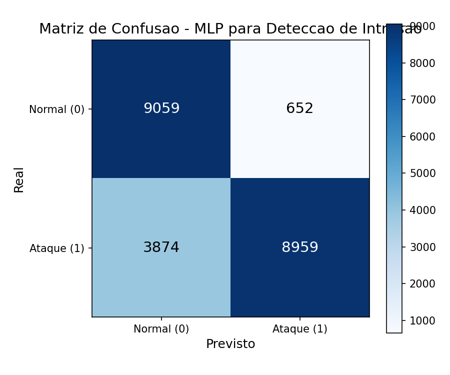

# Projeto 5 - Detecção de Intrusão em Redes (MLP)

## Descricao
Classificação binária de conexões de rede usando MLP (Multilayer Perceptron) com PyTorch para detecção de ataques (DoS, Probe, R2L, U2R).

**Disciplina:** PAM0466 - Sistemas Inteligentes (2026.1)

## Dataset
- **Fonte:** NSL-KDD (Canadian Institute for Cybersecurity)
- **Treino:** 125.973 conexoes
- **Teste:** 22.544 conexoes
- **Features:** 41 atributos (38 numericos + 3 categoricos)
- **Target:** 0 = normal, 1 = ataque

## Pre-processamento
1. One-hot encoding para protocol_type, service, flag (122 features finais)
2. Binarizacao do target (normal=0, ataque=1)
3. Normalizacao Z-score (usando estatisticas do treino)

## Arquitetura da MLP

**Topologia escolhida:** medium

| Camada | Tipo | Saida |
|--------|------|-------|
| Entrada | Input | 122 |
| Camada 1 | Linear + BatchNorm + ReLU + Dropout | 128 |
| Camada 2 | Linear + BatchNorm + ReLU + Dropout | 64 |
| Camada 3 | Linear + BatchNorm + ReLU + Dropout | 32 |
| Saida | Linear | 1 |

**Total de parametros:** 26.561

## Resultados da Avaliacao (limiar = 0.5)

| Metrica | Valor |
|---------|-------|
| Acuracia | 79.92% |
| Precisao | 93.22% |
| Recall | 69.81% |
| F1-score | 79.83% |

### Matriz de Confusao
| Real \ Previsto | Normal | Ataque |
|-----------------|--------|--------|
| Normal | 9.059 | 652 |
| Ataque | 3.874 | 8.959 |

### Analise por Limiar
| Limiar | Acuracia | Recall | FN | FP |
|--------|----------|--------|----|----|
| 0.1 | 81.29% | 72.89% | 3.479 | 738 |
| 0.3 | 80.42% | 71.05% | 3.715 | 700 |
| 0.5 | 79.92% | 69.81% | 3.874 | 652 |
| 0.7 | 80.02% | 69.23% | 3.949 | 555 |
| 0.9 | 80.11% | 68.07% | 4.097 | 388 |

## Analise de Erros em IDS

**Erro mais critico:** Falso Negativo (ataque classificado como normal)
- Consequencia: Invasao NAO DETECTADA, dano real ao sistema
- Este modelo apresenta 3.874 falsos negativos

**Erro menos critico:** Falso Positivo (normal classificado como ataque)
- Consequencia: Alarme falso, sobrecarga operacional

**Recomendacao para produção:** Usar limiar mais baixo (0.3-0.4) para priorizar deteccao de ataques, mesmo que gere mais falsos positivos.

## Curva de Loss


## Matriz de Confusão


## Como executar

```bash
cd projeto05_nslkdd
pip install -r requirements.txt
python main.py
```

## Estrutura do Projeto

```bash
projeto05_nslkdd/
├── data_loader.py      # Carregamento do NSL-KDD com kagglehub
├── preprocessing.py    # One-hot encoding, binarizacao, normalizacao
├── dataset.py          # TensorDataset e DataLoaders
├── model.py            # Arquitetura MLP
├── train.py            # Treinamento com early stopping
├── evaluate.py         # Avaliacao final e analise de limiares
├── main.py             # Orquestrador principal
├── requirements.txt
└── README.md
```

